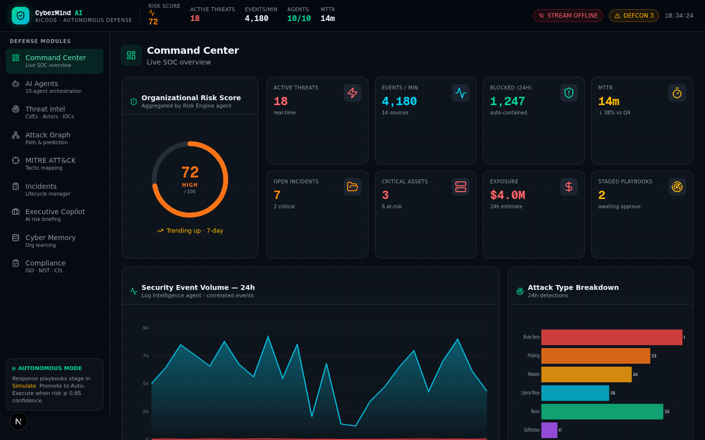
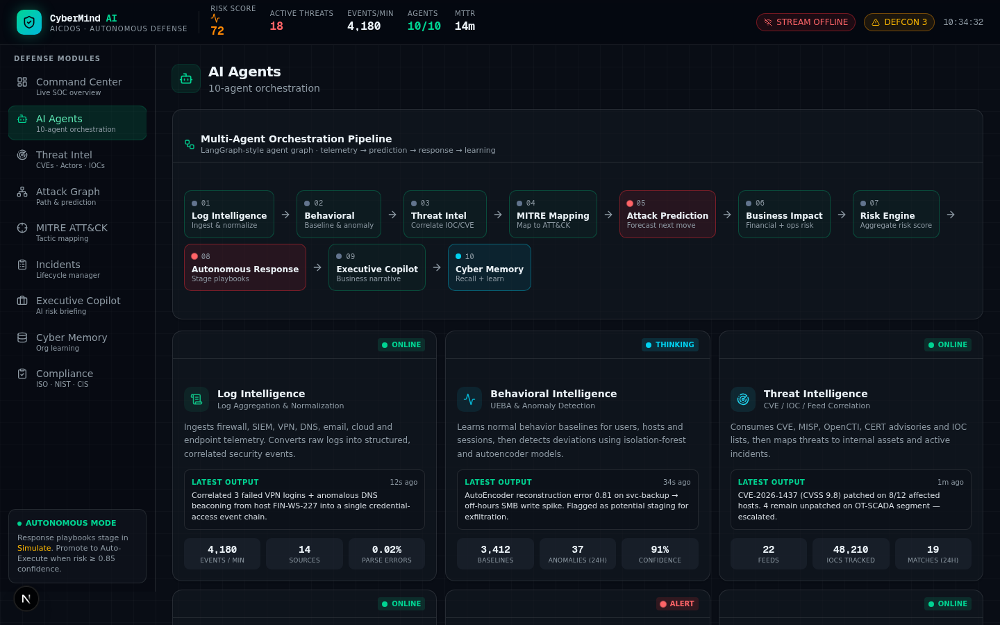
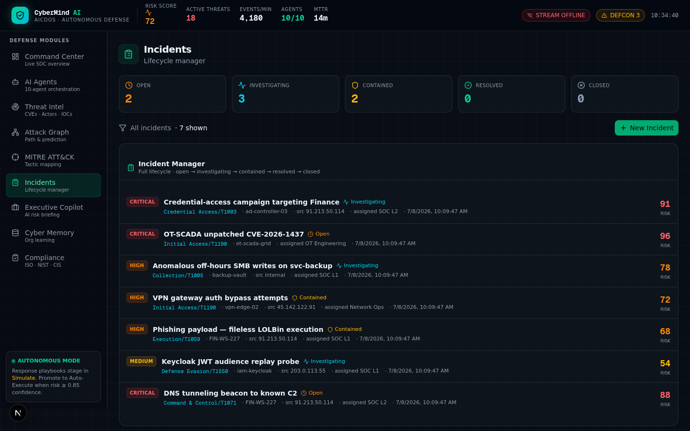
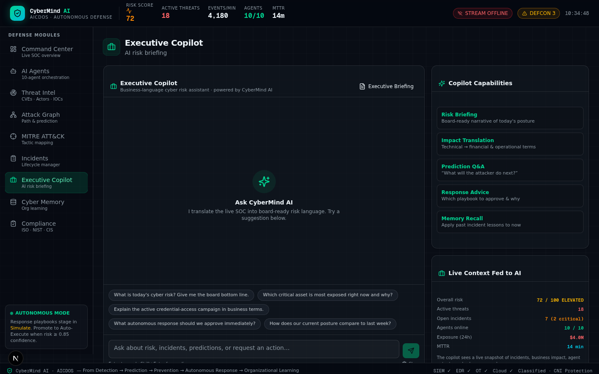

# 🛡️ CyberMind AI - Autonomous Cyber Defense Operating System (AICDOS)

[](https://nextjs.org/)
[](https://react.dev/)
[](https://www.typescriptlang.org/)
[](https://www.prisma.io/)
[](LICENSE)

> **From Detection → Prediction → Prevention → Autonomous Response → Organizational Learning**

CyberMind AI is an advanced, AI-powered autonomous cyber defense platform that orchestrates 10+ specialized AI agents to provide real-time threat detection, incident response, and organizational learning capabilities. Built for Security Operations Centers (SOCs) and enterprise security teams.



## 🌟 Key Features

### 🤖 AI-Powered Defense Modules

1. **Command Center** - Live SOC overview with real-time metrics
   - Risk scoring and visualization
   - Active threat monitoring
   - Event stream analytics (4,180+ events/min)
   - MTTR tracking
   - Global threat map with attack origin tracking

2. **Real-Time Dashboard** - Live security metrics and alerts
   - Network throughput monitoring
   - CPU and memory usage tracking
   - Active connections counter
   - Live security alerts stream
   - Agent activity logs
   - System health indicators
   - Sparkline visualizations

3. **Live Terminal** - Interactive command console
   - Real-time agent operations log
   - Command execution interface
   - Color-coded log levels (info, warning, error, success)
   - Export logs functionality
   - Pause/resume streaming
   - Agent status updates

4. **Network Traffic Monitor** - Real-time bandwidth analysis
   - Inbound/outbound traffic graphs
   - Packets per second tracking
   - Threat blocking statistics
   - Live traffic visualization
   - 120-second rolling window

5. **AI Agents** - 10-agent autonomous orchestration
   - Executive Analyst
   - Threat Hunter
   - Incident Responder
   - Compliance Auditor
   - Vulnerability Analyst
   - Forensics Specialist
   - Network Guardian
   - Cloud Security Expert
   - Data Protection Officer
   - OT/ICS Defender



6. **Threat Intelligence** - Comprehensive threat tracking
   - CVE monitoring and analysis
   - Threat actor profiling
   - IOC (Indicators of Compromise) management
   - Real-time threat feeds

7. **Attack Graph** - Visual attack path analysis
   - Path prediction and visualization
   - Kill chain mapping
   - Attack surface analysis

8. **MITRE ATT&CK** - Tactic and technique mapping
   - Full MITRE ATT&CK framework integration
   - Tactic coverage analysis
   - Technique detection mapping

9. **Incident Management** - Complete lifecycle management
   - Incident creation and tracking
   - Severity classification
   - Status workflow management
   - Response playbooks



10. **Executive Copilot** - AI-powered risk briefing
   - Executive-level security summaries
   - Risk trend analysis
   - Strategic recommendations
   - Natural language interface



11. **Cyber Memory** - Organizational learning system
   - Incident memory storage
   - Pattern recognition
   - Historical analysis
   - Lessons learned repository

12. **Compliance** - Multi-framework compliance tracking
   - ISO 27001 mapping
   - NIST framework alignment
   - CIS Controls
   - Automated compliance reporting

## 🏗️ Technology Stack

- **Frontend**: Next.js 16.1.1, React 19, TypeScript 5
- **UI Components**: Radix UI, shadcn/ui, Tailwind CSS 4
- **State Management**: Zustand, TanStack Query
- **Database**: Prisma with SQLite
- **Real-time**: Socket.IO for live threat streaming
- **AI/LLM**: Custom AI agent orchestration
- **Charts**: Recharts for data visualization
- **Forms**: React Hook Form with Zod validation
- **Animation**: Framer Motion

## 🚀 Quick Start

### Prerequisites

- Node.js 18+ or Bun 1.3+
- SQLite (included)
- Git

### Installation

1. **Clone the repository**
```bash
git clone https://github.com/kathirvel-p22/CyberMindAI.git
cd CyberMindAI
```

2. **Install dependencies**
```bash
# Using bun (recommended)
bun install

# Or using npm
npm install
```

3. **Set up environment variables**
```bash
# Copy .env.example to .env (if exists) or create .env
# Add your configuration
DATABASE_URL="file:./db/custom.db"
```

4. **Set up the database**
```bash
# Generate Prisma client
bun db:generate

# Push schema to database
bun db:push
```

5. **Run the development server**
```bash
bun dev
```

Open [http://localhost:3000](http://localhost:3000) in your browser.

## 📦 Available Scripts

```bash
# Development
bun dev              # Start development server on port 3000

# Build
bun build            # Build for production

# Production
bun start            # Start production server

# Database
bun db:push          # Push Prisma schema to database
bun db:generate      # Generate Prisma client
bun db:migrate       # Run database migrations
bun db:reset         # Reset database

# Code Quality
bun lint             # Run ESLint
```

## 🎯 Use Cases

- **Enterprise SOC**: Real-time threat monitoring and response
- **Security Operations**: Incident management and tracking
- **Compliance Teams**: Multi-framework compliance monitoring
- **Threat Intelligence**: CVE and IOC tracking
- **Executive Reporting**: AI-powered security briefings
- **Security Training**: Organizational learning from incidents

## 🔒 Security Features

- ✅ **Real-time threat detection** with live streaming
- ✅ **Autonomous response capabilities** with playbook automation
- ✅ **MITRE ATT&CK framework integration** with technique mapping
- ✅ **Multi-agent AI orchestration** (10 specialized agents)
- ✅ **SIEM, EDR, and OT integration** ready
- ✅ **Cloud security monitoring** for hybrid environments
- ✅ **Compliance automation** (ISO 27001, NIST, CIS)
- ✅ **Risk scoring and prediction** with AI models
- ✅ **Live terminal** with command execution
- ✅ **Network traffic monitoring** with real-time graphs
- ✅ **WebSocket-based threat streaming** (Socket.IO)
- ✅ **Interactive dashboards** with live metrics
- ✅ **Security alert notifications** with auto-classification
- ✅ **System health monitoring** with uptime tracking

## 📊 System Architecture

```
┌─────────────────────────────────────────────┐
│         CyberMind AI - AICDOS               │
├─────────────────────────────────────────────┤
│                                             │
│  ┌──────────┐  ┌──────────┐  ┌──────────┐ │
│  │ Command  │  │   AI     │  │  Threat  │ │
│  │ Center   │  │ Agents   │  │  Intel   │ │
│  └──────────┘  └──────────┘  └──────────┘ │
│                                             │
│  ┌──────────┐  ┌──────────┐  ┌──────────┐ │
│  │ Attack   │  │  MITRE   │  │Incidents │ │
│  │  Graph   │  │ ATT&CK   │  │          │ │
│  └──────────┘  └──────────┘  └──────────┘ │
│                                             │
│  ┌──────────┐  ┌──────────┐  ┌──────────┐ │
│  │Executive │  │  Cyber   │  │Compliance│ │
│  │ Copilot  │  │ Memory   │  │          │ │
│  └──────────┘  └──────────┘  └──────────┘ │
│                                             │
├─────────────────────────────────────────────┤
│           Data Layer (Prisma/SQLite)        │
└─────────────────────────────────────────────┘
```

## 🌐 Mini-Services

The platform includes modular mini-services for extended functionality:

- **threat-stream**: Real-time threat data streaming service
  - Located in `mini-services/threat-stream/`
  - WebSocket-based threat feed
  - Independent deployment

## 📁 Project Structure

```
CyberMindAI/
├── src/
│   ├── app/                    # Next.js app router
│   │   ├── api/               # API routes
│   │   │   ├── agents/        # AI agents endpoint
│   │   │   ├── incidents/     # Incident management
│   │   │   ├── threats/       # Threat intelligence
│   │   │   └── ...
│   │   ├── globals.css        # Global styles
│   │   ├── layout.tsx         # Root layout
│   │   └── page.tsx           # Home page
│   ├── components/
│   │   ├── cyber/             # Domain components
│   │   │   ├── command-center.tsx
│   │   │   ├── ai-agents.tsx
│   │   │   ├── threat-intel.tsx
│   │   │   └── ...
│   │   └── ui/                # UI components (shadcn/ui)
│   ├── hooks/                 # Custom React hooks
│   ├── lib/                   # Utilities and helpers
│   └── types/                 # TypeScript types
├── prisma/
│   └── schema.prisma          # Database schema
├── mini-services/             # Modular services
│   └── threat-stream/         # Real-time threat streaming
├── public/                    # Static assets
├── .zscripts/                 # Build and deployment scripts
└── package.json
```

## 🎨 Screenshots

### Command Center


### AI Agents


### Incidents Management


### Executive Copilot


## 🤝 Contributing

Contributions are welcome! Please feel free to submit a Pull Request.

1. Fork the repository
2. Create your feature branch (`git checkout -b feature/AmazingFeature`)
3. Commit your changes (`git commit -m 'Add some AmazingFeature'`)
4. Push to the branch (`git push origin feature/AmazingFeature`)
5. Open a Pull Request

## 📝 License

This project is licensed under the MIT License - see the [LICENSE](LICENSE) file for details.

## 🙏 Acknowledgments

- Built with [Next.js](https://nextjs.org/)
- UI components from [shadcn/ui](https://ui.shadcn.com/)
- Icons from [Lucide](https://lucide.dev/)
- MITRE ATT&CK framework reference

## 📧 Contact

Project Link: [https://github.com/kathirvel-p22/CyberMindAI](https://github.com/kathirvel-p22/CyberMindAI)

---

**DEFCON 3** · SIEM ✓ · EDR ✓ · OT ✓ · Cloud ✓ · Classified · CNI Protection

*From Detection → Prediction → Prevention → Autonomous Response → Organizational Learning*
